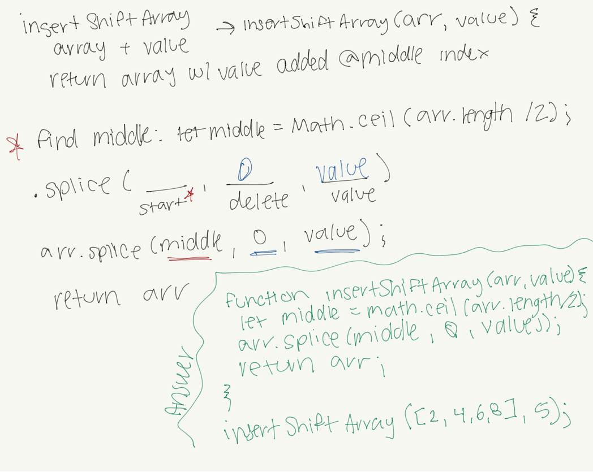

# Data Structures and Algorithms

See [setup instructions](https://codefellows.github.io/setup-guide/code-301/3-code-challenges), in the Code 301 Setup Guide.

## Repository Quick Tour and Usage

### 301 Code Challenges

Under the `data-structures-and-algorithms` repository, at the top level is a folder called `code-challenges`

Each day, you'll add one new file to this folder to do your work for the day's assigned code challenge

### 401 Data Structures, Code Challenges

- Please follow the instructions specific to your 401 language, which can be found in the directory below, matching your course.

# Code Challenges

## [Challenge 02 - array-shift](./javascript/code-challenges/arrayShift/array-shift.js)

### Challenge Summary
Write a function where you put a new value in the middle of an array.

### Challenge Description
Write a function called insertShiftArray which takes in an array and the value to be added. Without utilizing any of the built-in methods available to your language, return an array with the new value added at the middle index.

### Approach & Efficiency
I used the .splice method. When googling, I found that this was the most common practice. I looked up how splice works and it seemed like it would be the most effective way to put the new value in the middle of the array.

### Solution
