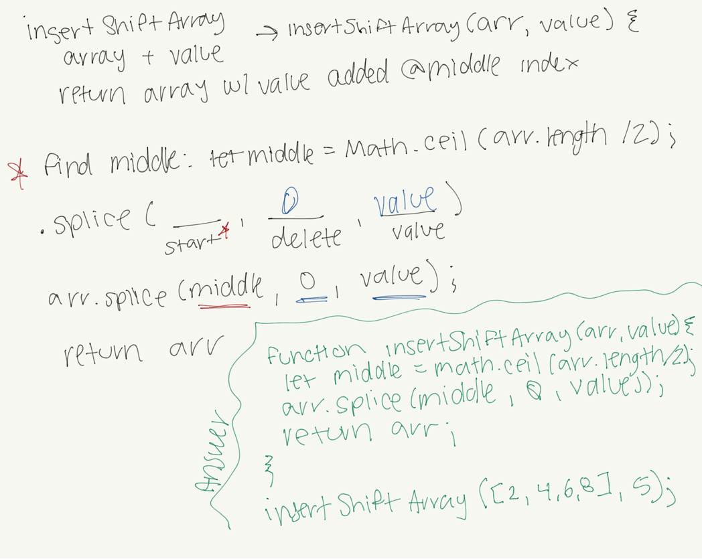
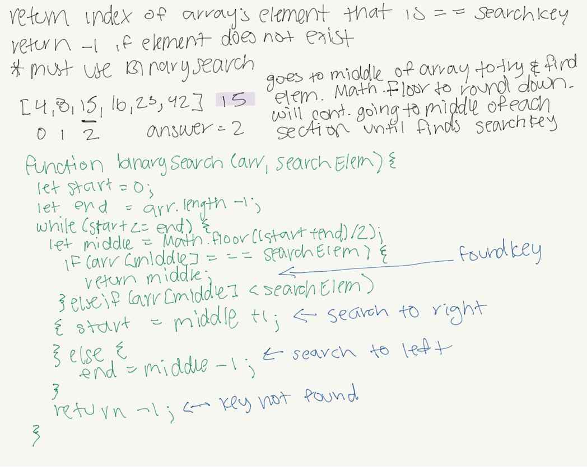

# Data Structures and Algorithms

See [setup instructions](https://codefellows.github.io/setup-guide/code-301/3-code-challenges), in the Code 301 Setup Guide.

## Repository Quick Tour and Usage

### 301 Code Challenges

Under the `data-structures-and-algorithms` repository, at the top level is a folder called `code-challenges`

Each day, you'll add one new file to this folder to do your work for the day's assigned code challenge

### 401 Data Structures, Code Challenges

- Please follow the instructions specific to your 401 language, which can be found in the directory below, matching your course.

# Code Challenges

## [Challenge 02 - array-shift](./javascript/code-challenges/arrayShift/array-shift.js)

### Challenge Summary
Write a function where you put a new value in the middle of an array.

### Challenge Description
Write a function called insertShiftArray which takes in an array and the value to be added. Without utilizing any of the built-in methods available to your language, return an array with the new value added at the middle index.

### Approach & Efficiency
I used the .splice method. When googling, I found that this was the most common practice. I looked up how splice works and it seemed like it would be the most effective way to put the new value in the middle of the array.

### Solution

## [Challenge 03 - array-binary-search](./javascript/code-challenges/arrayBinarySearch/array-binary-search.js)

### Challenge Summary
Write a function where you use binary search to find an element in the array

### Challenge Description
Write a function called BinarySearch which takes in 2 parameters: a sorted array and the search key. Without utilizing any of the built-in methods available to your language, return the index of the array’s element that is equal to the search key, or -1 if the element does not exist.
NOTE: The search algorithm used in your function should be a binary search.

### Approach & Efficiency
I used binary search. I had to look up how to use it and found this page: [link to resource](https://stackabuse.com/binary-search-in-javascript/). This page did a great job at explaining how this code works and what the process of this code is.

### Solution

## [Challenge 05 - Linked List 1](./javascript/code-challenges/linkedList/ll.js)

### Challenge Summary
Define a method for insert that adds a new node to the head of the list. Define a method called includes that takes any value to return a boolean. Define a method call toString that returns a string of all the values in the list.

### Challenge Description
- Create a Node class that has properties for the value stored in the Node, and a pointer to the next Node.
- Within your LinkedList class, include a head property. Upon instantiation, an empty Linked List should be created.
  - Define a method called insert which takes any value as an argument and adds a new node with that value to the head of the list with an O(1) Time performance.
  - Define a method called includes which takes any value as an argument and returns a boolean result depending on whether that value exists as a Node’s value somewhere within the list.
  - Define a method called toString (or __str__ in Python) which takes in no arguments and returns a string representing all the values in the Linked List, formatted as:
    - "{ a } -> { b } -> { c } -> NULL"
- Any exceptions or errors that come from your code should be semantic, capturable errors. For example, rather than a default error thrown by your language, your code should raise/throw a custom, semantic error that describes what went wrong in calling the methods you wrote for this lab.
- Be sure to follow your language/frameworks standard naming conventions (e.g. C# uses PascalCasing for all method and class names).

### Approach & Efficiency
- For the method called insert, I used Brian's demo code and changed everything that said append to insert. Append adds to the end and insert is what added to the head of the list which is why we were able to make that change.
- For the includes method I was able to google more methods that works with linked lists to have a better understanding of what you're supposed to do. I found [this article](https://codeburst.io/js-data-structures-linked-list-3ed4d63e6571) and was able to attempt includes.
- For the toString method I knew I needed to find a way to concat my values to the format that is required by the assignment. I wasn't able to figure it out with concat but was able to use template literals to create how I wanted my string to be formatted.

### API
**insert** The method creates a new node. If the head doesn't exist then it will set the head. Else, it will start the traversal. The while loop will go through everything and creates the actual traversal. When you get to the end you'll see current.next setting the node as the next value. At the end, return this to return the whole list.

**includes** The method set thisNode to null with val as an argument. It goes through the while loop, if theNode's value strict equals to val then it will return true because that means it is found in the link list. If thisNode reaches the end at thisNode.next then it will return false.

**toString** The method sets thisNode to null and string to an empty string. It goes through the while loop with thisNode. We have our empty string and we're adding the thisNode's value. If it reaches the end and is at thisNode.next which will equal null, then the string will add NULL. thisNode = thiseNode.next; will be the end of the loop and will return the populated string.

## [Challenge 06 - Linked List 2](./javascript/code-challenges/linkedList/ll.js)

### Challenge Summary
Define a method for append that adds a new node to the end of the list. Define a method for insertBefore that adds a new node before a value. Define a method for insertAfter that adds a new node after a value.

### Challenge Description
- .append(value) which adds a new node with the given value to the end of the list
- .insertBefore(value, newVal) which add a new node with the given newValue immediately before the first value node
- .insertAfter(value, newVal) which add a new node with the given newValue immediately after the first value node

### Approach & Efficiency
- For the method called append, I used Brian's demo code. Append adds to the end.
- Know that we have to loop through our list to find value, once we find current before value, we will insert newVal before.
- Know that we have to loop through our list to find value, once we find value, we will insert newVal after.

### API
**append** The method creates a new node. If the head doesn't exist then it will set the head. Else, it will start the traversal. The while loop will go through everything and creates the actual traversal. When you get to the end you'll see current.next setting the node as the next value. At the end, return this to return the whole list.

**insertBefore** Set current to this.head. Our edgecase is if head is strict equal to the value, then we will need to create a new node, have the new node point to the original head, then change the new node to be seen as the new head. If it's not at the head, then we will loop through the list to find value. Once we find value, create a new node, have the new node point to the current.next, then have the current node point to the new node. Return to end the while loop.

**insertAfter** We will loop through the list to find value. Once we find value, create a new node, have the new node point to the current.next, then have the current node point to the new node. Return to end the while loop.

## [Challenge 07 - Linked List 3](./javascript/code-challenges/linkedList/ll.js)

### Challenge Summary
Write a method where you take a number, k, to find the value of a node that is k from the end of the linked list.

### Challenge Description
Write a method for the Linked List class which takes a number, k, as a parameter. Return the node’s value that is k from the end of the linked list. You have access to the Node class and all the properties on the Linked List class as well as the methods created in previous challenges.

### Approach & Efficiency
I had to google a few ways to understand what exactly was going on with the code. I tried to look at it as if I was working with an array and trying to find the last item in the array. I ended up using index to attempt getting k from the end. I also saw people using helper functions so I wrote out get to have a function that will help me get to the kth from the end.

### API
**kthFromEnd** In get, I set index to default -1. If index is less than 0 (a negative number) or if it was longer than the linked list, it would return null. Next I set this.head to current. I created a for loop and you'll be looping through current to equal current.next so you're looping through the entire linklist. At the end of the loop, you would return the final value of current aka the link list. Next I created my kthFromEnd function. If k was less than 0, it would return null so negative numbers do not work. Besides that, you'll run the .get function, find the length of the list, minus one to line up the numbers in your index and minus the value of k which was how many spots you want to move from the end. You would then return that final answer.

## [Challenge 08 - LL zip](./javascript/code-challenges/llZip/ll-zip.js)

### Challenge Summary
Write a function that will zip two linked lists together into one list. Nodes from list1 will alternate with list2.

### Challenge Description
Write a function called zipLists which takes two linked lists as arguments. Zip the two linked lists together into one so that the nodes alternate between the two lists and return a reference to the head of the zipped list. Try and keep additional space down to O(1). You have access to the Node class and all the properties on the Linked List class as well as the methods created in previous challenges.

### Approach & Efficiency
- I want to find a way to append items in each list to a new list

### API
**zipLists** I created a new LinkedList as well as created a count for my list. I try to find the max length of list1 vs list2 to know how many times I need to loop through my for loop. In my for loop, I have conditionals where if my list1 has something in the index, then I will append it to my new list. I do the same thing with my list2. Outside of my loop, I return the answer which would be the new LinkedList.

## [Challenge 08 - Stacks and Queues](./javascript/code-challenges/stacksAndQueues/stacks-and-queues.js)

### Challenge Summary
Write methods that will push, pop, peek, and isEmpty for a Stack class. Write methods that will enqueue, dequeue, peek, and isEmpty for a Queue class.

### Challenge Description
- Create a Node class that has properties for the value stored in the Node, and a pointer to the next node.
- Create a Stack class that has a top property. It creates an empty Stack when instantiated.
  - This object should be aware of a default empty value assigned to top when the stack is created.
  - Define a method called push which takes any value as an argument and adds a new node with that value to the top of the stack with an O(1) Time performance.
  - Define a method called pop that does not take any argument, removes the node from the top of the stack, and returns the node’s value.
  Should raise exception when called on empty stack
  - Define a method called peek that does not take an argument and returns the value of the node located on top of the stack, without removing it from the stack.
  - Should raise exception when called on empty stack
  - Define a method called isEmpty that takes no argument, and returns a boolean indicating whether or not the stack is empty.
- Create a Queue class that has a front property. It creates an empty Queue when instantiated.
  - This object should be aware of a default empty value assigned to front when the queue is created.
  - Define a method called enqueue which takes any value as an argument and adds a new node with that value to the back of the queue with an O(1) Time performance.
  - Define a method called dequeue that does not take any argument, removes the node from the front of the queue, and returns the node’s value.
  - Should raise exception when called on empty queue
  - Define a method called peek that does not take an argument and returns the value of the node located in the front of the queue, without removing it from the queue.
  - Should raise exception when called on empty queue
  - Define a method called isEmpty that takes no argument, and returns a boolean indicating whether or not the queue is empty.

### Approach & Efficiency
- **push** I want to add new node(s) to the top of the stack
- **pop** I want to remove node(s) from the top of the stack
- **peek** I want to see what node is located on the top of the stack
- **enqueue** I want to add new node(s) to the back of the queue
- **dequeue** I want to remove node(s) from the front of the queue
- **peek** I want to see what node is located in the front of the queue
- **isEmpty** I want to see if the stack/queue is empty

### API
- **push** It is creating a key on itself, called the evaluation of this.length. We then assign it to the parameter called value. Once that is completed, this.length is then incremented by 1. We then return this.
- **pop** We first find if the stack is empty. If the length is equal to 0, it will return the string 'empty stack'. We declared a variable called result. We assign result to a property of itself at this.length minus 1. We decrement the this.length by 1. To properly pop, we need to delete. We will delete at property of this.length. In the end, we return result.
- **enqueue** It is creating a key on itself, called the evaluation of this.length. We then assign it to the parameter called value. Once that is completed, this.length is then incremented by 1. We then return this.
- **dequeue** We first find if the queue is empty. If the length is equal to 0, it will return the string 'empty queue'. We declared a variable called result. We assign result to a property of itself at this.length minus 1. We decrement the this.length by 1. To properly pop, we need to delete. We will delete at property of this.length. In the end, we return result.
- **peek** For both stack and queue, I want to see what node is at the top of the stack or the front of the queue. First we see if it is empty. If this.length is 0, it will return empty. Else, it will continue with the code. We declared a variable called result. We assign result to a property of itself at this.length minus 1. We decrement the this.length by 1. 
- **isEmpty** For both stack and queue, isEmpty is trying to see if the stack/queue is empty. To determine that, if the length is 0, then it will return true. Else, if there is anything inside of the stack/queue, it will return false.

## [Challenge 08 - Stacks and Queues](./javascript/code-challenges/stacksAndQueues/stacks-and-queues.js)

### Challenge Summary
Write methods that will push, pop, peek, and isEmpty for a Stack class. Write methods that will enqueue, dequeue, peek, and isEmpty for a Queue class.

### Challenge Description
- Create a Node class that has properties for the value stored in the Node, and a pointer to the next node.
- Create a Stack class that has a top property. It creates an empty Stack when instantiated.
  - This object should be aware of a default empty value assigned to top when the stack is created.
  - Define a method called push which takes any value as an argument and adds a new node with that value to the top of the stack with an O(1) Time performance.
  - Define a method called pop that does not take any argument, removes the node from the top of the stack, and returns the node’s value.
  Should raise exception when called on empty stack
  - Define a method called peek that does not take an argument and returns the value of the node located on top of the stack, without removing it from the stack.
  - Should raise exception when called on empty stack
  - Define a method called isEmpty that takes no argument, and returns a boolean indicating whether or not the stack is empty.
- Create a Queue class that has a front property. It creates an empty Queue when instantiated.
  - This object should be aware of a default empty value assigned to front when the queue is created.
  - Define a method called enqueue which takes any value as an argument and adds a new node with that value to the back of the queue with an O(1) Time performance.
  - Define a method called dequeue that does not take any argument, removes the node from the front of the queue, and returns the node’s value.
  - Should raise exception when called on empty queue
  - Define a method called peek that does not take an argument and returns the value of the node located in the front of the queue, without removing it from the queue.
  - Should raise exception when called on empty queue
  - Define a method called isEmpty that takes no argument, and returns a boolean indicating whether or not the queue is empty.

### Approach & Efficiency
- **push** I want to add new node(s) to the top of the stack
- **pop** I want to remove node(s) from the top of the stack
- **peek** I want to see what node is located on the top of the stack
- **enqueue** I want to add new node(s) to the back of the queue
- **dequeue** I want to remove node(s) from the front of the queue
- **peek** I want to see what node is located in the front of the queue
- **isEmpty** I want to see if the stack/queue is empty

### API
- **push** It is creating a key on itself, called the evaluation of this.length. We then assign it to the parameter called value. Once that is completed, this.length is then incremented by 1. We then return this.
- **pop** We first find if the stack is empty. If the length is equal to 0, it will return the string 'empty stack'. We declared a variable called result. We assign result to a property of itself at this.length minus 1. We decrement the this.length by 1. To properly pop, we need to delete. We will delete at property of this.length. In the end, we return result.
- **enqueue** It is creating a key on itself, called the evaluation of this.length. We then assign it to the parameter called value. Once that is completed, this.length is then incremented by 1. We then return this.
- **dequeue** We first find if the queue is empty. If the length is equal to 0, it will return the string 'empty queue'. We declared a variable called result. We assign result to a property of itself at this.length minus 1. We decrement the this.length by 1. To properly pop, we need to delete. We will delete at property of this.length. In the end, we return result.
- **peek** For both stack and queue, I want to see what node is at the top of the stack or the front of the queue. First we see if it is empty. If this.length is 0, it will return empty. Else, it will continue with the code. We declared a variable called result. We assign result to a property of itself at this.length minus 1. We decrement the this.length by 1. 
- **isEmpty** For both stack and queue, isEmpty is trying to see if the stack/queue is empty. To determine that, if the length is 0, then it will return true. Else, if there is anything inside of the stack/queue, it will return false.

## [Challenge 11 - Queue with Stacks](./javascript/code-challenges/queueWithStacks/queue-with-stacks.js)

### Challenge Summary
Create a new class called PseudoQueue, use this to implement a queue with 2 stacks.

### Challenge Description
Create a brand new PseudoQueue class. Do not use an existing Queue. Instead, this PseudoQueue class will implement our standard queue interface (the two methods listed below), but will internally only utilize 2 Stack objects. Ensure that you create your class with the following methods:

- enqueue(value) which inserts value into the PseudoQueue, using a first-in, first-out approach.
- dequeue() which extracts a value from the PseudoQueue, using a first-in, first-out approach.

The Stack instances have only push, pop, and peek methods. You should use your own Stack implementation. Instantiate these Stack objects in your PseudoQueue constructor.

### Approach & Efficiency
- **enqueue** I want to add/push to the stack
- **dequeue** I want to remove/pop off the stack

### API
- **enqueue** If there is stuff in stack1, then we will push the popped item from stack1 into stack2. We will also push the value from the params into stack1. Likewise, if there is stuff in stack2, then we will push the popped item from stack2 into stack1.
- **dequeue** When there is stuff in stack1, we will push the stuff that was popped from stack1 into stack2. We will return the item that we are popping because that's what is being removed.

## [Challenge 12 - Animal Shelter](./javascript/code-challenges/fifoAnimalShelter/fifo-animal-shelter.js)

### Challenge Summary
Create a new class called AnimalShelter, use this to implement a queue with queues.

### Challenge Description
Create a class called AnimalShelter which holds only dogs and cats. The shelter operates using a first-in, first-out approach.
Implement the following methods:

- enqueue(animal): adds animal to the shelter. animal can be either a dog or a cat object.
- dequeue(pref): returns either a dog or a cat. If pref is not "dog" or "cat" then return null.

### Approach & Efficiency
- **enqueue** I want to add to the AnimalShelter
- **dequeue** I want to remove from the AnimalShelter

### API
- **enqueue** If the animal type is a cat, then we will call the enqueue method from our queue.js. If the animal type is a dog, we will call the enqueue method from our queue.js. Else, we will return null. The enqueue method does the following: It is creating a key on itself, called the evaluation of this.length. We then assign it to the parameter called value. Once that is completed, this.length is then incremented by 1. We then return this.

- **dequeue** If the animal type is a cat, we will call the dequeue method from our queue.js. If the animal type is a dog, we will call the dequeue method from our queue. Else, we will return null. The dequeue method does the following: We first find if the queue is empty. If the length is equal to 0, it will return the string 'empty queue'. We declared a variable called result. We assign result to a property of itself at this.length minus 1. We decrement the this.length by 1. To properly pop, we need to delete. We will delete at property of this.length. In the end, we return result.

## [Challenge 13 - multiBracketValidation](./javascript/code-challenges/multiBracketValidation/multi-bracket-validation.js)

### Challenge Summary
Write a function that validates if there are matching brackets.

### Challenge Description
On your main file, create a function called multiBracketValidation(input) Your function should take a string as its only argument, and should return a boolean representing whether or not the brackets in the string are balanced. There are 3 types of brackets:

- Round Brackets : ()
- Square Brackets : []
- Curly Brackets : {}

### Approach & Efficiency
- I want to look for bracket matches. I will use a counter to add 1 if there is an opening bracket and a -1 if there is a closing bracket. That will make my count 0 and I will return true.

### API
- I created a count and set it to 0 so that I can use that to keep track of my brackets. We loop through the input looking for (, [, and {. If it is there, we will increase the count. Next we will look for ), ], }. If we couldn't find (, [, and { from the first if, count will be 0 which will return false meaning there is no match. Else, if they find a match, we will -1 on the count. Finally, if our final count is 0, then we will return true because that means there were bracket matches. If there is 1 because it only found the opening bracket, then it will return false.